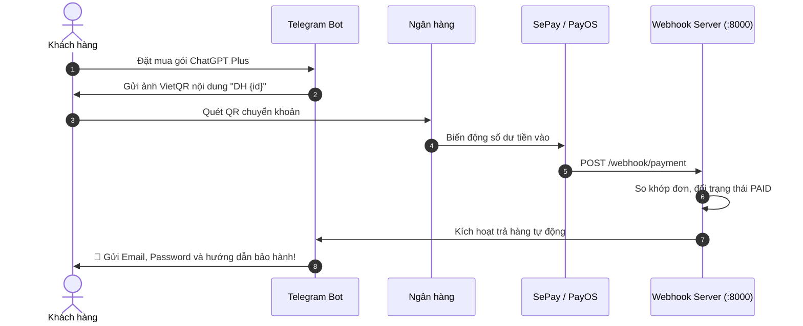

# Telegram Shop Bot - ChatGPT Plus Store

A robust, production-ready Telegram Shop Bot built with Python 3.10+, [python-telegram-bot](https://github.com/python-telegram-bot/python-telegram-bot) (v20+ async), [SQLAlchemy](https://www.sqlalchemy.org/) (v2.0+), dynamic **VietQR Banking Payment**, and **Automated Payment Webhook & Package Delivery** (SePay / PayOS).

## 🏛️ Clean Architecture

The project follows clean architecture principles, separating concerns into dedicated layers:

```text
bot-chat/
├── .env.example              # Template for environment configuration
├── .gitignore                 # Standard Python git ignore rules
├── requirements.txt           # Project dependencies
├── config.py                  # Environment loader & config validation
├── webhook_server.py          # aiohttp payment webhook server (SePay / PayOS / Simulation)
├── main.py                    # Entry point: DB init, webhook server, bot polling
├── database/
│   ├── __init__.py            # Database exports
│   ├── database.py            # Engine, sessionmaker, Base, and get_db context manager
│   └── models.py              # User, Product, Order, OrderItem models
├── services/
│   ├── __init__.py            # Services exports
│   ├── order_service.py       # Catalog, cart, and order business logic & VietQR generator
│   └── payment_service.py     # Payment matching and automated package fulfillment
└── handlers/
    ├── __init__.py            # Handler exports
    ├── start_handler.py       # /start, /test_pay command & interactive inline menus
    └── checkout_handler.py    # FSM ConversationHandler for ordering workflow & VietQR
```

---

## 🤖 Bảng giá dịch vụ ChatGPT Plus

| ID | Gói dịch vụ | Giá (VND) | Tồn kho | Mô tả & Bảo hành |
| :---: | :--- | :---: | :---: | :--- |
| **1** | **ChatGPT Plus 1 Tháng (Bảo hành full)** | **275.000đ** | 999 | Bảo hành 1 đổi 1 trọn vẹn 30 ngày |
| **2** | **ChatGPT Plus 1 Tháng (Không bảo hành)** | **150.000đ** | 999 | Giá tiết kiệm, tài khoản dùng riêng |

---

## ⚡ Tự động trả gói hàng qua Webhook (SePay / PayOS)



---

## 🚀 Setup & Chạy ứng dụng

### 1. Cấu hình file `.env`
Mở file `.env` và điền:
```env
# Telegram Bot Token
TELEGRAM_TOKEN=your_telegram_bot_token_here
DATABASE_URL=sqlite:///shop_bot.db

# VietQR Banking (Tài khoản nhận tiền của bạn)
BANK_ID=MB
BANK_ACCOUNT=0123456789
BANK_ACCOUNT_NAME=NGUYEN VAN A

# Webhook Server
WEBHOOK_HOST=0.0.0.0
WEBHOOK_PORT=8000
SEPAY_API_KEY=
ADMIN_CHAT_ID=
```

### 2. Khởi động bot & webhook server
Chạy lệnh PowerShell:
```powershell
.\venv\Scripts\python.exe main.py
```

Khi chạy, hệ thống sẽ:
1. Tự động khởi động **Telegram Shop Bot Polling**.
2. Tự động mở **Webhook Server** tại `http://0.0.0.0:8000`.

---

## 📜 Danh sách câu lệnh tương tác (Bot Commands & UI)

### 👤 1. Dành cho Khách hàng (Customer Commands)

| Câu lệnh / Nút bấm | Mô tả chi tiết |
| :--- | :--- |
| **`/start`** | Khởi động bot. Nếu là lần đầu tiên, bot sẽ yêu cầu chọn ngôn ngữ (🇻🇳 Tiếng Việt hoặc 🇬🇧 English). Sau đó mở menu tương tác chính. |
| **`🛒 Đơn hàng của tôi`** | Tra cứu lịch sử mua hàng: Hiển thị trạng thái đơn, tên gói, tổng tiền và **toàn bộ thông tin tài khoản đã mua** (Email, Mật khẩu, 2FA, mã OTP 30s mới nhất) để sao chép nhanh bất cứ lúc nào. |
| **`🌐 Đổi ngôn ngữ (Language)`** | Nút bấm trực tiếp trên menu chính, cho phép khách hàng đổi qua lại giữa Tiếng Việt và Tiếng Anh bất kỳ lúc nào. |
| **`/buy`** hoặc **`/checkout`** | Bắt đầu quy trình chọn mua gói dịch vụ trực tiếp. |
| **`/cancel`** | Hủy bỏ quy trình đặt mua đang diễn ra bất cứ lúc nào. |
| **`/myid`** | Xem thông tin tài khoản Telegram của bạn (User ID, Username) và trạng thái phân quyền (Khách hàng hoặc Admin). |

> [!TIP]
> **Hệ thống Đa ngôn ngữ (Bilingual System):**  
> Lựa chọn ngôn ngữ của khách hàng được gắn và lưu vào CSDL (`users.language`). Toàn bộ menu, bảng giá, xác nhận đơn hàng, hướng dẫn chuyển khoản VietQR và tin nhắn tự động gửi tài khoản (Email, Mật khẩu, OTP 2FA, chính sách bảo hành) đều được bản địa hóa 100% theo ngôn ngữ khách đã chọn.

---

### 👑 2. Dành cho Quản trị viên (Admin Only Commands)

> [!IMPORTANT]
> Để sử dụng các lệnh Admin bên dưới, bạn cần lấy **Telegram ID** (qua lệnh `/myid`) và điền vào biến `ADMIN_CHAT_ID` trong file `.env`.  
> *(Có thể cấu hình nhiều Admin, phân cách bằng dấu phẩy: `ADMIN_CHAT_ID=123456789,987654321`)*.

| Câu lệnh Admin | Cú pháp & Ví dụ | Chức năng |
| :--- | :--- | :--- |
| **`/stock`** | `/stock` | **Báo cáo tồn kho thời gian thực:** Xem chi tiết số lượng tài khoản có sẵn để bán, số lượng đã bán và trạng thái từng gói dịch vụ. |
| **`/addstock`** | `/addstock <ID> <email \| pass \| 2fa>` | **Nạp tài khoản trực tiếp qua Telegram & Tự động phát thông báo:**<br>• `ID`: Mã gói sản phẩm (ví dụ `1` hoặc `2`).<br>• Hỗ trợ nạp 1 hoặc hàng loạt tài khoản.<br>• **Tự động gửi thông báo hàng mới về (Restock Alert)** kèm ảnh gói và nút **[ ⚡ Mua ngay ]** đến tất cả khách hàng từng nhắn tin với bot (theo ngôn ngữ của từng khách).<br>*Ví dụ:*<br>`/addstock 1 user1@gmail.com \| Pass123! \| 2FA_KEY_HERE` |
| **`/test_pay`** | `/test_pay <mã_đơn>` | **Giả lập thanh toán đơn hàng:** Kích hoạt lập tức luồng giao hàng tự động mà không cần chuyển khoản thật *(Ví dụ: `/test_pay 1`)*. |

---

### 🖼️ 3. Quản lý Hình ảnh Sản phẩm (Product Images)

Hình ảnh minh họa sản phẩm được tự động liên kết vào kịch bản bán hàng. Bạn chỉ cần đặt file ảnh vào thư mục:
👉 **`images/products/`** *(hoặc thư mục `images/`)*

* **Ảnh chi tiết mặt hàng:**
  * Gói Bảo hành full: `chatgpt_plus_warranty.png` (hoặc `1.png` / `1.jpg`)
  * Gói Không bảo hành: `chatgpt_plus_no_warranty.png` (hoặc `2.png` / `2.jpg`)
* **Ảnh bìa chung:**
  * Đặt tên `banner.png` (hoặc `banner.jpg`): Hiển thị làm banner khi khách xem danh mục bảng giá.

---

### 🛠️ 4. Công cụ dòng lệnh nạp hàng (CLI Script)

Ngoài việc nạp kho bằng lệnh `/addstock` trên Telegram, bạn có thể nạp tài khoản hàng loạt từ file văn bản qua terminal máy chủ (khi nạp thành công, công cụ cũng sẽ tự động gửi thông báo hàng mới về kèm nút mua ngay tới tất cả khách hàng):

```powershell
.\venv\Scripts\python.exe add_stock.py
```

---

## 🧪 Cách kiểm tra (Test) tự động trả hàng

### Cách 1: Test ngay trong chat Telegram bằng lệnh `/test_pay`
1. Đặt 1 đơn hàng trên bot (ví dụ đơn số `1`).
2. Gửi lệnh:
   ```text
   /test_pay 1
   ```
3. Bot sẽ ngay lập tức kích hoạt luồng trả hàng tự động và gửi tài khoản ChatGPT Plus cho bạn!

### Cách 2: Test qua Webhook Simulation Endpoint
Từ terminal PowerShell, gửi lệnh curl giả lập tiền về:
```powershell
curl.exe -X POST http://127.0.0.1:8000/webhook/fake-payment -H "Content-Type: application/json" -d '{"order_id": 1}'
```

### Cách 3: Nối thực tế với SePay.vn
1. Tạo tài khoản miễn phí tại [SePay.vn](https://sepay.vn).
2. Thêm số tài khoản ngân hàng của bạn.
3. Cài đặt Webhook trên SePay trỏ về:
   `https://telebotgpt.neitman.id.vn/webhook/payment`
4. Mỗi khi khách chuyển tiền thật quét QR, SePay sẽ bắn webhook và bot tự động gửi hàng cho khách sau 1-2 giây!

